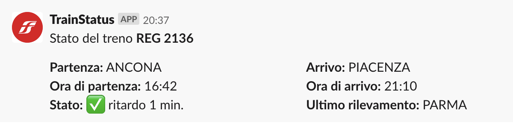

# TrainStatus Slack Command

The Trenitalia integration for Slack gives you and your teams the ability to retrieve the status of a Train by its own number.

## Installing the Trenitalia integration for Slack

Before the configure the application on Slack you need to deploy the application on a remote server.
This library comes out with a serverless configuration. This means you are able to deploy on AWS and automatically create an API Gateway endpoint to paste on Slack configuration.

### Deploy the application with Serverless

You need to configure your AWS credentials with a profile and your personal credentials. Find out more info at https://docs.aws.amazon.com/polly/latest/dg/setup-aws-cli.html. Now you can deploy the application on AWS.

    serverless deploy --aws-profile <your-aws-profile> --region <your-aws-region>

The CLI will output the endpoint of your API gateway.

### Run the application on local environment

You can try locally the application with the following command:

    npm run debug

The file `event.json` contains an example of Slack request body. Here you can customize the number of the train.

## Usage

    /train <trainNumber>

## Screenshot

